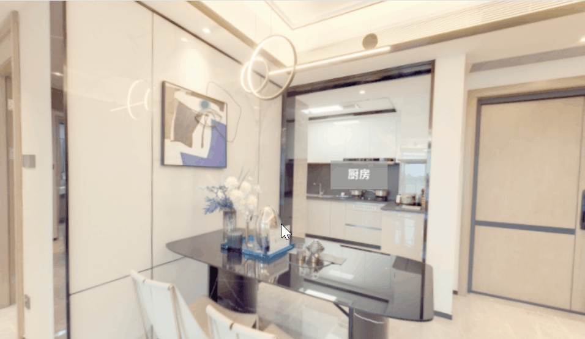

<h2 align="center">
VR 看房项目
</h2>

## 📰 介绍

该项目是基于 React + Three.js 构建的 3D 虚拟现实看房，提供沉浸式的房间浏览体验。

## 🎊 功能特点

- **3D场景漫游** ：360度全景查看客厅、阳台、厨房

- **智能导航** ：点击位置标识在不同房间间切换

- **交互提示** ：鼠标悬停显示物品详细信息

- **视角控制** ：鼠标拖拽自由调整观看角度

- **平滑动画** ：使用 GSAP 实现流畅的场景切换

## 🔧 技术栈

- **前端框架**: React + TypeScript

- **3D引擎**: Three.js

- **动画库**: GSAP

- **构建工具**: Vite

## 🏗️ 项目结构

```bash
├── public/                    # 静态资源
├── src/ 
│   ├── utils/                 # 工具类
│   │   ├── Room.ts            # 房间 3D 场景类
│   │   ├── PositionSprite.ts  # 位置导航精灵
│   │   └── TooltipSprite.ts   # 信息提示精灵
│   ├── App.tsx                # 主组件
│   ├── App.css                # 样式文件
│   ├── main.tsx               # 应用入口
└── package.json               # 项目依赖
```

## 🚀 快速开始

```bash
git clone https://github.com/Yang0107-liyyy/vr-house.git
cd vr-house
pnpm install
pnpm run dev
```

### 构建

```bash
pnpm run build
```

## 📸 效果预览


